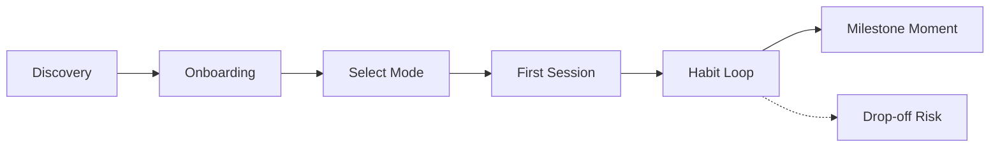

# User Journey

**Status:** Locked v1.0
**Phase:** 4 of 19 — User Journey
**Depends on:** `01-product-vision.md`, `02-prd.md`, `03-personas.md`

## 1. Discovery
Out of scope to design for MVP (growth, not product). Assumed entry point: organic install, likely word-of-mouth or a shared portfolio link initially.

## 2. Onboarding
Quick sign-up, then 2–3 questions: what's coming up (interview / client call / general confidence), and how comfortable the user feels speaking English under pressure. Personalizes session 1 from the start.

## 3. Select Mode
User picks Interview Practice or Workplace Communication (see `02-prd.md` for mode definitions). Both feed the same core pipeline; mode selection just determines the scenario set and feedback rubric.

## 4. First Session (the moment that decides retention)
A scenario matched to the user's stated goal, a voice response, feedback within ~15–20s that feels specific rather than templated, and the first streak/XP tick. This session either earns a day-2 open or doesn't.

## 5. Habit Loop (days 2–14)
Short daily sessions, streak reinforcement, and — critically — the mentor referencing the *previous* session ("Last time you rambled around the STAR structure — let's tighten that today"). This is where the core differentiator either delivers or the product quietly becomes "just another practice app."

## 6. Milestone Moment
The user has the actual interview or call. A simple check-in prompt afterward ("How did it go?") closes the loop emotionally and gives real signal on whether the product is working, not just whether sessions are being logged.

## 7. Drop-off Risks (named honestly)
- Feedback starts feeling repetitive or generic
- No perceived progress
- No external nudge to return (no push notifications scoped in v1)
- Residual self-consciousness even in private use

These risks directly shape Phase 6 (Gamification Design) — the counter-pressure against churn.
