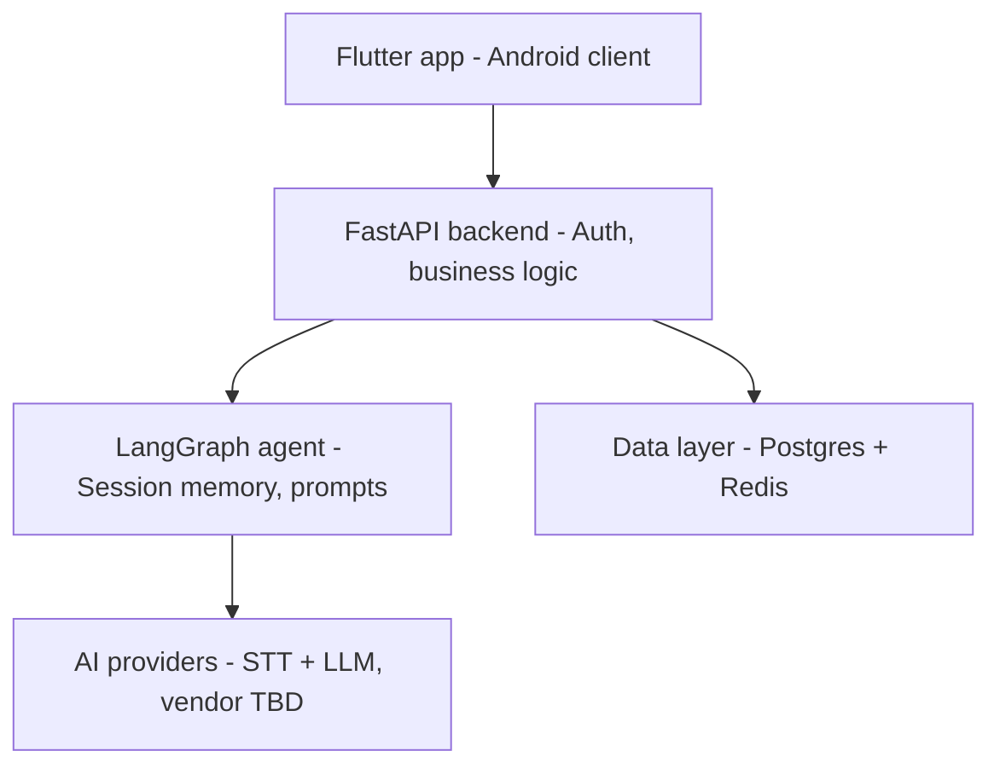

# System Architecture

**Status:** Locked v1.0
**Phase:** 7 of 19 — System Architecture
**Depends on:** `02-prd.md`, `05-feature-prioritization.md`, `06-gamification-design.md`

## Overview

Firebase Auth sits alongside this (client SDK + backend token verification) rather than as its own service box. Specific STT/LLM vendors are deliberately left unlabeled — that's a Phase 13 decision, not an architecture one.

## Key Decisions

### 1. Voice data: transcript only, raw audio discarded after processing
Storing raw recordings would enable richer prosody analysis (pace, tone) later, but multiplies the sensitive-data liability already flagged in the PRD, plus storage cost. Transcript-based feedback covers everything the v1 feedback engine needs. Privacy-by-design over premature capability.

### 2. Synchronous request/response for feedback generation
The ~15–20s latency target from the PRD fits within a mobile loading state. Simpler to build than an async job + polling/websocket setup. Revisit only if pipeline latency grows meaningfully.

### 3. Mentor memory: recency-based SQL retrieval, not vector search
With a handful of sessions per user early on, pulling the last 1–3 session summaries from Postgres is simpler and just as effective as a vector store. FAISS-based semantic retrieval is a clean V2 upgrade once session history and query complexity justify it — not a v1 requirement.

### 4. LangGraph, even though the v1 flow is linear
A plain LangChain chain would technically suffice for "transcript in, structured feedback out." LangGraph is used anyway because the mentor's job grows (multi-turn dialogue, branching feedback, quest logic in V2), and because demonstrating agentic orchestration is explicitly part of this project's portfolio goal. Building the state-machine patterns now avoids retrofitting them later under time pressure.
