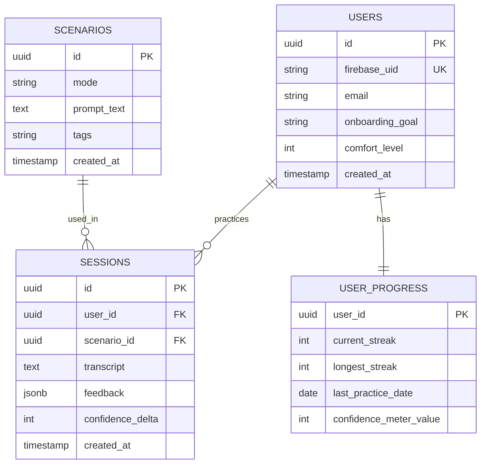

# Database Design

**Status:** Locked v1.0
**Phase:** 8 of 19 — Database Design
**Depends on:** `07-architecture.md`

## Entity Relationship Diagram

## Key Decisions

### 1. `feedback` is JSONB, not normalized columns
The AI feedback schema (strengths, growth areas, STAR-adherence score, filler-word count) will keep evolving as prompts get tuned in Phase 13. JSONB means schema changes there don't require a migration here. Trade-off: harder to run SQL aggregates across users later — worth normalizing specific fields into generated columns if that need materializes, not before.

### 2. `user_progress` is a separate table, not columns on `users`
Keeps identity data (auth-linked) cleanly separated from mutable game state. Costs one extra JOIN; buys a `users` table that stays stable while gamification logic evolves underneath it, and a clean read surface for the future admin dashboard.

### 3. `current_level` is computed, never stored
Derived at read time from `confidence_meter_value` against the four static thresholds from Phase 6. Storing it risks silent drift out of sync with the meter value; computing it is a few lines of application logic and can never be wrong.

### 4. No separate "mentor memory" table
`sessions` already holds transcript + feedback per user — that's the memory store. The query is "last 1–3 sessions for this user, ordered by `created_at` descending," directly reflecting the Phase 7 decision to skip vector search for now. Index `sessions(user_id, created_at)` — that composite index is what makes this query, and the progress view, fast.
